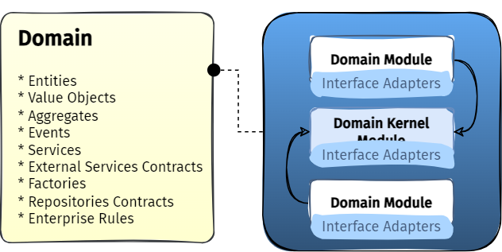
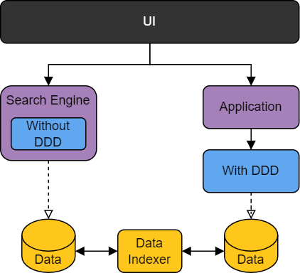

# Arquitetura da Aplicação

Este é um resumo dos pontos fundamentais da arquitetura de uma aplicação
nos moldes CleanArch.

Seguimos as orientação de _Robert C. Martin (Uncle Bob)_ em seu artigo _"The Clean Architecture"_.

> https://blog.cleancoder.com/uncle-bob/2012/08/13/the-clean-architecture.html

As regras fundamentais que precisam ser obedecidas:

* A dependência se dá de fora para dentro. Ou seja, as camadas externas dependem e podem acessar livremente as camadas internas.

* Uma camada interna desconhece as camadas externas. Quando precisar acessar o mundo externo, o fará através de _interfaces_.

## 1. Camada de apresentação, ou _executor de aplicação_

> No desenho na cor cinza, caixa "App Runner"

Essa é a única camada que o usuário tem acesso diretamente, e o único ponto de
contato que inicia as demais ações. É também aqui que o carregamento das configurações ocorrem, junto a ligação com os recursos de infraestrutura.

Os itens abaixo são componentes desta camada:

* src/CleanArch.Templates.Solution.WebApi
* src/CleanArch.Templates.Solution.Worker
* src/CleanArch.Templates.Solution.Cli

## 2. Camada de aplicação

> No desenho na cor roxa, caixa "Application Modulo"

Essa é a camada com as funções negociais que a camada de apresentação pode chamar
junto a seus modelos parâmetros. O objetivo nesta camada não é aplicar as regras
de negócio em si, mas orquestrar os objetos que aplicam as regras, ou pesquisar
por dados armazenados pela aplicação que aplica as regras de negócio.

Os itens abaixo são componentes desta camada:

* src/CleanArch.Templates.Solution.Application
* src/CleanArch.Templates.Solution.SearchEngine

## 3. Camada de domínio

> No desenho na cor azul, caixa "Domain Module".

Essa é a camada onde de fato as ações aplicam as regras de negócio.
Usamos DDD para implementá-la.

O item abaixo é o componente desta camada:

* src/CleanArch.Templates.Solution.Domain

## Visão geral da relação entre as camadas

Este é um desenho que resume bem a arquitetura:

* Basicamente temos 2 componentes de aplicação:
  - _Application_ que cuida de toda persistência
  - _Search Engine_ que cuida de toda otimização de pesquisa de dados
  - Essa, e **somente essa** camada, é a responsável por entregar as interfaces de usuário o que a aplicação pode fazer

* Uma aplicação não manipula os dados diretamente sem passar pela camada de domínio

* Um mecanismo de pesquisa (um tipo de aplicação) pode acessar diretamente os dados para otimizar a entrega de informações, mas **nunca** deve manipular tais dados.

* Mecanismos de infraestrutura (como indexadores) podem ser constuídos livremente para otimizar o acesso a dados.